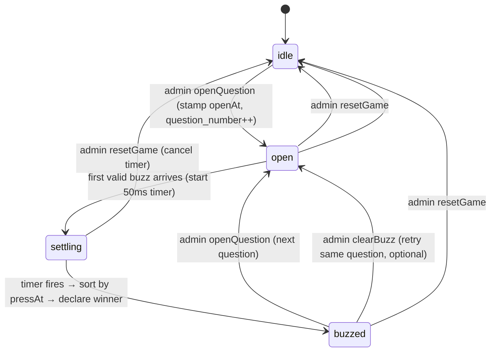

# Local Buzzer System — Design Document

> Self-hosted, offline, low-fairness-error buzzer for a live conference game.
> Replaces the Base44 backend (see [ANALYSIS.md](ANALYSIS.md)) with a local Node + SQLite server.
> Status: **design, ready to implement end-to-end.** Prepared 2026-06-01.

---

## Table of contents

1. [Goals & non-goals](#1-goals--non-goals)
2. [Context & constraints](#2-context--constraints)
3. [Core principle: fairness, not latency](#3-core-principle-fairness-not-latency)
4. [System architecture](#4-system-architecture)
5. [Network & hardware setup](#5-network--hardware-setup)
6. [Tablet provisioning](#6-tablet-provisioning)
7. [Data model (SQLite)](#7-data-model-sqlite)
8. [Server design](#8-server-design)
9. [WebSocket protocol](#9-websocket-protocol)
10. [Clock synchronization](#10-clock-synchronization)
11. [Buzz arbitration (edge timestamps + settling window)](#11-buzz-arbitration-edge-timestamps--settling-window)
12. [Game state machine](#12-game-state-machine)
13. [Client design](#13-client-design)
14. [Failure handling & recovery](#14-failure-handling--recovery)
15. [Latency & fairness budget](#15-latency--fairness-budget)
16. [Calibration & diagnostics](#16-calibration--diagnostics)
17. [Tech stack & file layout](#17-tech-stack--file-layout)
18. [Implementation plan (phased)](#18-implementation-plan-phased)
19. [Test & validation plan](#19-test--validation-plan)
20. [Venue runbook](#20-venue-runbook)
21. [Migration map from the current app](#21-migration-map-from-the-current-app)

---

## 1. Goals & non-goals

### Goals
- **Correctly and fairly determine which team pressed first**, resolving ties far finer than human reaction differences (target: ≤ ~3 ms resolution).
- Run **100% offline** on local hardware — no internet, no Base44, no cloud.
- A single operator (host) controls the game; 4 team tablets buzz; one big display shows results in a large hall.
- **Robust and "flawless"** for a one-shot live event: graceful reconnect, no stuck states, deterministic winner, no last-write-wins races.

### Non-goals
- Public/attendee phones (we use 4 dedicated tablets we control).
- Authentication / multi-tenant / accounts (single trusted LAN, single event).
- Horizontal scale (4 teams; a single Node process is the authority).
- Persisting across multiple events / analytics beyond a simple round log.

---

## 2. Context & constraints

| Parameter | Decision |
|---|---|
| Buzzer devices | **4 dedicated tablets** (we own & pre-configure them), browser-based |
| Teams | **~4** (one tablet per team) |
| Venue | **Large hall** — AP placement & range matter |
| Connectivity | **Dedicated local Wi-Fi AP**, no internet in the data path |
| Backend | **Node.js + SQLite**, single local host (laptop/mini-PC) |
| Transport | **WebSocket** over the LAN |
| Fairness mechanism | **Edge timestamps + clock sync + ~50 ms settling window** |
| Authority | The Node server is the **single source of truth** |

Because the tablets are **ours**, we exploit it: pre-joined Wi-Fi, kiosk lock, screen-wake-lock, team pinned per device, Wi-Fi power-save disabled. This eliminates the biggest field risks.

---

## 3. Core principle: fairness, not latency

A buzzer does **not** need minimal latency — it needs **correct ordering**. If every tablet had a constant 80 ms delay it would still be perfectly fair. The failure mode to design out is **variable latency deciding the winner**.

Two strategies:
- **(A) Equalize transport latency** (Bluetooth/USB/cabling) — can never be perfectly equal, and is impractical/iOS-hostile for tablets.
- **(B) Timestamp the press at the edge with synchronized clocks, and order by timestamp, not arrival.** ← **We use this.**

With (B), a tablet can be slow to *report* its press and still win if it *pressed* first. **Transport latency becomes nearly irrelevant to fairness**; it only affects how long the server waits before declaring (the settling window). Clock sync on a LAN reaches ~1–3 ms; human "tie" differences are 10–100 ms. So we resolve order well below what any human can contest.

> Consequence: we do **not** use Bluetooth or USB. We use ordinary Wi-Fi on a **dedicated** AP, and win on timestamps.

---

## 4. System architecture

```
                       ┌─────────────────────────────────────────┐
                       │   HOST MACHINE (laptop / mini-PC)         │
                       │                                           │
                       │   Node server  ── in-memory game state    │
                       │     │            (single authority)       │
                       │     ├── WebSocket server (ws)             │
                       │     ├── Static file server (client build) │
                       │     ├── SQLite (better-sqlite3)           │
                       │     └── Admin UI (localhost only)         │
                       │                                           │
                       │   Display page (browser) ── HDMI ───────────► PROJECTOR
                       └───────────────┬───────────────────────────┘
                                       │ Ethernet (wired)
                                ┌──────┴───────┐
                                │ DEDICATED AP │  (5 GHz, private SSID, no internet)
                                └──────┬───────┘
                  ┌──────────┬─────────┼─────────┬──────────┐  Wi-Fi
              ┌───┴───┐  ┌───┴───┐ ┌───┴───┐ ┌───┴───┐
              │Tablet1│  │Tablet2│ │Tablet3│ │Tablet4│   (one per team, kiosk-locked)
              └───────┘  └───────┘ └───────┘ └───────┘
```

- **Host** runs everything: WS server, static client, SQLite, and the **Display** page locally (HDMI to the projector → display path touches no network).
- **Host is wired** to the AP so the 4 tablets own the Wi-Fi airtime.
- **Tablets** are the only wireless game-critical devices; they connect by Wi-Fi and hold one persistent WebSocket each.
- **No internet** is required at any point.

---

## 5. Network & hardware setup

### Access point
- A **dedicated travel/home router** (e.g., GL.iNet or any decent dual-band router) — *not* the venue Wi-Fi.
- **5 GHz**, WPA2, hidden-or-not private SSID used only for the game. 5 GHz is cleaner spectrum; with only 4 clients there is effectively zero contention.
- Pick a **clean channel** (scan at the venue during setup).
- **Placement (large hall):** put the AP **centrally among the 4 team tables**, not in a corner. With only 4 known positions this is trivial to plan. If teams are spread far or there are obstructions, prefer **2.4 GHz** for range, or add a second AP — but realistically place the AP within ~10–15 m line-of-sight of the tablets.
- **Internet:** not needed (we run our own clock sync, not NTP). Optionally attach a WAN uplink only to keep any stray OS connectivity checks quiet — irrelevant for kiosk-locked tablets.

### Host
- Laptop or mini-PC, **wired (Ethernet) to the AP**.
- Runs Node server + serves the client + runs the Display page in a browser → **HDMI to the projector**. For a large hall with a distant projector, use an HDMI extender / a dedicated mini-PC at the projector running just the Display page (display latency is non-critical, so even Wi-Fi for the display device is fine).

### Display
- Preferred: **rendered on the host**, HDMI to projector — zero network in the result path.
- Alternative: a separate device at the projector loading `/display` over Wi-Fi (acceptable; display lag doesn't affect fairness).

---

## 6. Tablet provisioning

One-time setup per tablet (we own them — do this before the event):
- Join the dedicated **SSID**; verify it auto-reconnects.
- **Disable Wi-Fi power saving** where possible; disable cellular (or airplane mode + Wi-Fi on) to prevent dropping off a no-internet AP.
- **Kiosk / Guided Access** locked to the buzzer URL (`http://<host>:<port>/play` or `http://buzzer.local/play`).
- **Screen never sleeps**, brightness up, notifications off, auto-update off.
- **Pin the team**: on first load, set the team via a one-time `?team=<id>` URL or an operator picker; persist `teamId` in `localStorage`. Each tablet is then permanently "Team N".
- The buzzer page additionally requests the **Screen Wake Lock API** at runtime as a belt-and-suspenders against sleep (also keeps the Wi-Fi radio active).

> Result: at the venue we power them on and they're already on the right network, locked to the right team, awake.

---

## 7. Data model (SQLite)

SQLite is for **persistence, recovery, and audit** — it is **not** in the buzz hot path (the in-memory state decides; SQLite is write-behind).

```sql
-- schema.sql
CREATE TABLE IF NOT EXISTS teams (
  id          TEXT PRIMARY KEY,         -- uuid/short id
  name        TEXT NOT NULL,
  color       TEXT NOT NULL,            -- hex
  banner_url  TEXT,                     -- optional local asset path
  slot        INTEGER NOT NULL          -- 1..4 display order / tablet binding
);

CREATE TABLE IF NOT EXISTS rounds (
  id              TEXT PRIMARY KEY,
  question_number INTEGER NOT NULL,
  opened_at       REAL NOT NULL,        -- server clock (ms)
  status          TEXT NOT NULL,        -- 'open' | 'buzzed' | 'reset'
  winner_team_id  TEXT,                 -- FK teams.id
  winner_press_at REAL,                 -- server clock (ms)
  closed_at       REAL
);

CREATE TABLE IF NOT EXISTS buzzes (
  id              INTEGER PRIMARY KEY AUTOINCREMENT,
  round_id        TEXT NOT NULL,        -- FK rounds.id
  team_id         TEXT NOT NULL,        -- FK teams.id
  press_at        REAL NOT NULL,        -- edge timestamp, server clock (ms)
  received_at     REAL NOT NULL,        -- when server got it (ms)
  rtt_ms          REAL,                 -- last measured RTT for that client
  accepted        INTEGER NOT NULL,     -- 1 winner-eligible, 0 rejected
  reject_reason   TEXT,                 -- 'too_late' | 'false_start' | 'duplicate' | null
  rank            INTEGER               -- final ordering within the round
);

CREATE TABLE IF NOT EXISTS settings (
  key   TEXT PRIMARY KEY,
  value TEXT NOT NULL                   -- e.g. settling_window_ms = "50"
);
```

In-memory mirror of the live round (authoritative during play):

```js
currentRound = {
  id, questionNumber,
  openAt,                         // server ms
  status,                         // 'idle' | 'open' | 'settling' | 'buzzed'
  presses: Map<teamId, { teamId, pressAt, receivedAt, rtt }>,
  settleTimer, winner
}
```

---

## 8. Server design

- **Single Node process = single authority.** No external DB round-trips in the decision path.
- **Atomicity for free:** Node's single-threaded event loop serializes incoming `buzz` messages. The first one handled for an open round starts the settling window; there is no way for two presses to be "simultaneously" processed, so the last-write-wins race from the current Base44 design is structurally impossible.
- **In-memory authority, write-behind SQLite:** decisions happen on `currentRound` in memory; we persist rounds/buzzes asynchronously after deciding (with `better-sqlite3`, writes are sub-ms and synchronous, but still done *after* broadcasting the result).
- **Broadcast model:** on every meaningful state change the server pushes a message to all connected clients (tablets, display, admin). Late joiners/reconnects get a full `state` snapshot.
- **Roles:** each WS connection declares a role in `hello`: `tablet` (+teamId), `display`, or `admin`. Admin is only served/opened on the host machine; optionally gate admin actions behind a shared secret in `hello`.

Responsibilities:
- Serve the built client (static files) + the WS endpoint on one origin/port.
- Maintain team list (CRUD via admin, persisted to `teams`).
- Drive the game state machine (open / reset / arbitrate / declare).
- Run the clock-sync `ping`/`pong` responder.
- Track presence (which tablets are connected) from live WS connections — no heartbeat polling needed; the socket *is* the presence.

---

## 9. WebSocket protocol

JSON text frames. `t` = server clock ms unless noted. All timestamps that matter are in **server time** (clients convert via their offset before sending).

### Client → Server

| type | payload | sent by | meaning |
|---|---|---|---|
| `hello` | `{ role, teamId?, clientId, secret? }` | all | identify on connect |
| `ping` | `{ seq, t0 }` | all | clock-sync probe (`t0` = client `performance.now()`) |
| `buzz` | `{ roundId, pressAt }` | tablet | a press; `pressAt` in **server time** |
| `openQuestion` | `{}` | admin | start a new question (status→open) |
| `clearBuzz` | `{ roundId }` | admin | clear current buzz, reopen same question (optional) |
| `resetGame` | `{}` | admin | back to idle, question_number→0 |
| `upsertTeam` | `{ id?, name, color, banner_url, slot }` | admin | create/edit team |
| `deleteTeam` | `{ id }` | admin | remove team |

### Server → Client

| type | payload | meaning |
|---|---|---|
| `pong` | `{ seq, t0, tServer }` | clock-sync reply |
| `state` | `{ status, roundId, questionNumber, openAt, teams[], connected[], winner? }` | full snapshot (on connect/reconnect & on change) |
| `roundOpen` | `{ roundId, questionNumber, openAt }` | a question opened — buzzers go live |
| `buzzResult` | `{ roundId, winner:{teamId,name,color,pressAt}, ranking:[{teamId,pressAt,rank}] }` | winner declared after settling |
| `rejected` | `{ roundId, reason }` | your buzz was not accepted (`too_late`/`false_start`/`duplicate`) |
| `reset` | `{}` | game reset to idle |
| `presence` | `{ connected:[teamId...] }` | which tablets are currently connected |
| `error` | `{ message }` | protocol/validation error |

A tiny request/response helper (`rpc`) is used only for `ping`/`pong` (correlated by `seq`); everything else is fire-and-forget broadcast.

---

## 10. Clock synchronization

Goal: estimate `clockOffset` such that `serverTime ≈ clientPerfNow + clockOffset`, to ~1–3 ms.

**Algorithm (Cristian's / SNTP-style), run on connect and every 5 s:**

```js
// CLIENT
async function syncOnce(sock) {
  const samples = [];
  for (let i = 0; i < 10; i++) {
    const t0 = performance.now();
    const { tServer } = await rpc(sock, 'ping', { seq: i, t0 });
    const t1 = performance.now();
    const rtt = t1 - t0;
    const offset = tServer - (t0 + t1) / 2;   // add to client time → server time
    samples.push({ rtt, offset });
  }
  samples.sort((a, b) => a.rtt - b.rtt);
  return samples[0];                            // MIN-RTT sample = least queuing noise
}

// maintain offset; prefer the lowest-RTT sample seen recently; correct drift slowly
clockOffset = best.offset;
lastRtt     = best.rtt;
```

```js
// SERVER
import { performance } from 'node:perf_hooks';
const serverNow = () => performance.now();      // monotonic, sub-ms
onPing(conn, { seq, t0 }) => conn.send({ type:'pong', seq, t0, tServer: serverNow() });
```

Notes:
- Use **`performance.now()`** (monotonic) on both ends — immune to wall-clock jumps. Both are in the same units (ms); the offset bridges their different origins.
- **Min-RTT selection** discards samples delayed by transient airtime/queuing; the least-delayed round trip gives the truest offset.
- **Gate buzzing on a completed sync:** a tablet shows "syncing…" and cannot buzz until its first sync completes (prevents bad-clock presses). Re-sync after any reconnect.

---

## 11. Buzz arbitration (edge timestamps + settling window)

### Edge timestamp (client)
Capture at the **physical press**, on `pointerdown`/`touchstart`, using the event's own high-resolution timestamp (same time origin as `performance.now()`), and send immediately — **no React state in the critical path**:

```js
buzzerEl.addEventListener('pointerdown', (e) => {
  if (!live || alreadyBuzzed) return;
  const pressAt = e.timeStamp + clockOffset;   // server time of the actual press
  sock.send(JSON.stringify({ type:'buzz', roundId, pressAt }));
  // optimistic local "pressed" UI; real result comes from buzzResult
}, { passive:false });
```
(Fallback for any browser where `e.timeStamp` isn't high-res: capture `performance.now()` as the first line of the handler.)

### Server arbitration

```js
const SETTLING_WINDOW_MS = 50;          // default; calibrated per venue
const CLOCK_TOLERANCE_MS = 5;           // forgive sub-sync-error early presses

function onBuzz(conn, { roundId, pressAt }) {
  const r = currentRound;
  if (!r || r.id !== roundId)            return reject(conn, 'stale_round');
  if (r.status === 'buzzed')             return reject(conn, 'too_late');
  if (pressAt < r.openAt - CLOCK_TOLERANCE_MS) return reject(conn, 'false_start');
  if (r.presses.has(conn.teamId))        return; // duplicate / mash → ignore

  r.presses.set(conn.teamId, { teamId: conn.teamId, pressAt, receivedAt: serverNow(), rtt: conn.lastRtt });

  if (r.status === 'open') {             // first arrival starts the window
    r.status = 'settling';
    r.settleTimer = setTimeout(() => finalize(r), SETTLING_WINDOW_MS);
  }
  // if already 'settling', this press simply joins the candidate set
}

function finalize(r) {
  r.status = 'buzzed';
  const ranked = [...r.presses.values()].sort((a, b) => a.pressAt - b.pressAt);
  ranked.forEach((p, i) => p.rank = i + 1);
  r.winner = ranked[0];
  persistRoundAndBuzzes(r, ranked);                 // write-behind
  broadcast({ type:'buzzResult', roundId:r.id,
              winner:r.winner, ranking:ranked.map(({teamId,pressAt,rank}) => ({teamId,pressAt,rank})) });
}
```

### Why 50 ms is the right window
The window only needs to cover **network delivery jitter between near-simultaneous presses**, *not* the spacing between human reactions:
- If two players press within a few ms of each other, their packets arrive within the LAN's jitter (a few ms on a clean 4-client AP). 50 ms comfortably collects both, then we sort by `pressAt` → the true earliest wins.
- If one player presses 200 ms after another, the late one is *genuinely* late and correctly loses — we don't (and shouldn't) wait for it; the window started at the first arrival.
- 50 ms is **imperceptible** to humans (the winner flash/sound is 50 ms later than the press — invisible).

With only 4 tablets on a dedicated AP, jitter is tiny; **50 ms is conservative and safe**, and can be calibrated down (see §16). The window covers jitter; the timestamp decides the winner.

---

## 12. Game state machine



- `settling` is internal; tablets/display can keep showing "open" visuals during it (it's ≤50 ms).
- Only the server transitions state. Clients render whatever the latest `state`/event says.
- Buzzes are only valid for the **current** `roundId`; stale-round buzzes are rejected.

---

## 13. Client design

Reuse the **existing React UI** (buzzer button, display visuals, admin controls) and swap the data layer.

### Shared net layer (new)
- `net/socket.js` — single WebSocket with auto-reconnect (exponential backoff), `hello` on (re)connect, message dispatch to a small store.
- `net/clockSync.js` — the offset estimator from §10; exposes `toServerTime(perfTs)` and `synced` flag.
- A lightweight store (Zustand or a context+reducer) holds `state` from the server. **Drop React-Query and `@base44/sdk`.**

### Tablet — buzzer (`/play`)
- Reads `teamId` from `localStorage` (pinned during provisioning).
- Renders waiting/live/won/lost from server `state` + `buzzResult`.
- On `pointerdown`: timestamp → `buzz` (see §11). Disables after sending until next `roundOpen`.
- Requests **Wake Lock**; shows a clear **connection + sync** indicator; "syncing…" disables the button until first sync completes.
- Handles `rejected` (`too_late`→"missed", `false_start`→optional brief lockout UI).

### Display (`/display`)
- Renders idle/open/buzzed from server state; plays the buzzer sound on `buzzResult`.
- Shows the 4 teams' connection dots from `presence`.
- Shows winner banner/name (and optionally the full `ranking` for transparency).

### Admin (`/`, host only)
- "New question" → `openQuestion`; "Reset" → `resetGame`; optional "Clear buzz" → `clearBuzz`.
- Team CRUD → `upsertTeam`/`deleteTeam`.
- **Diagnostics panel** (see §16): per-tablet offset, RTT, last-seen, last round ranking with `pressAt` deltas.

---

## 14. Failure handling & recovery

| Scenario | Behavior |
|---|---|
| Tablet Wi-Fi drop | WS auto-reconnects (backoff) → re-`hello` → re-sync clock → server pushes current `state`. Button re-enables only after sync. |
| Tablet sleeps | Prevented by kiosk + Wake Lock; if it still happens, reconnect path above recovers it. |
| Buzz send fails | No silent lockout: optimistic UI is reverted on disconnect; on reconnect the current round state is authoritative. (Fixes the current "pressing stuck true" bug.) |
| Duplicate / mashed presses | Ignored per (round, team). |
| Press after winner declared | `rejected: too_late` → "missed" UI. |
| Press before open (clock-adjusted) | `rejected: false_start`; optional configurable short lockout for that round. |
| Bad/early clock (not yet synced) | Buzzing disabled until first sync; outliers rejected. |
| **Server restart** | On boot, load `teams` + last round from SQLite; **reset live round to `idle`** (never resume a half-open round); tablets reconnect automatically and get fresh `state`. |
| Two admin tabs | Harmless — both talk to the one authority; state is server-owned (no duplicate "sessions" like the Base44 design). |
| Display device drop | Cosmetic; reconnects and re-renders from `state`. |

---

## 15. Latency & fairness budget

On the dedicated AP with 4 tablets:

| Stage | Typical |
|---|---|
| Tap → timestamp captured (synchronous handler) | ~0 ms |
| Timestamp → on the wire (pre-open WS, tiny frame) | < 1 ms |
| Wire → server (single LAN hop, 4 clients, clean 5 GHz) | ~2–8 ms (jitter absorbed by the 50 ms window) |
| Server decision (in-memory, event-loop-atomic) | microseconds |
| **Fairness resolution — what actually picks the winner** | **≈ clock-sync error, ~1–3 ms, independent of all the above** |
| Winner → display/tablets (broadcast) | ~LAN hop (not fairness-critical) |

**Bottom line:** the winner is decided by synchronized press timestamps to ~1–3 ms — well below human contestability — regardless of Wi-Fi latency.

---

## 16. Calibration & diagnostics

### Setup-time calibration
- After tablets connect at the venue, open the **diagnostics panel** and read each tablet's **RTT distribution** and **clock offset**.
- Set `SETTLING_WINDOW_MS` = a safe cover of observed one-way jitter, e.g. `ceil(p99_RTT/2) + 10 ms`. With 4 tablets on a clean AP this is typically well under 50 ms; keep 50 ms as a safe default, lower only if you want snappier feedback and the numbers support it. Stored in `settings`.

### Diagnostics panel (admin)
- Per tablet: connected?, last RTT, clock offset, last-seen.
- Last round: full `ranking` with `pressAt` and **inter-press deltas** (e.g. "Team B +4 ms behind Team A") — makes close calls transparent and builds trust.
- A **self-test**: fire synthetic simultaneous presses from a script (see §19) and confirm the earliest `pressAt` wins.

---

## 17. Tech stack & file layout

**Server:** Node 20, [`ws`](https://github.com/websockets/ws) (WebSocket), [`better-sqlite3`](https://github.com/WiseLibs/better-sqlite3) (synchronous, fast, zero-config, perfect for local), a tiny static-file server (built-in `http` or `fastify`/`express`). Optional `mdns`/`bonjour-service` to advertise `buzzer.local`.

**Client:** keep React + Vite + the existing UI components and Tailwind. Remove `@base44/sdk`, `@tanstack/react-query`, and the Base44 auth/app-params plumbing. Add the small `net/` layer. Build is served by the Node server (single origin).

```
/server
  index.js           # bootstrap: static files + ws + db
  ws.js              # connection lifecycle, role routing, broadcast
  game.js            # in-memory authority, state machine, arbitration, settling window
  clock.js           # serverNow(), ping/pong responder
  db.js              # better-sqlite3 setup + prepared statements
  schema.sql
  settings.js        # load/save SETTLING_WINDOW_MS etc.
/src                 # existing React client, rewired
  net/socket.js      # WS client + auto-reconnect + hello
  net/clockSync.js   # offset estimation, toServerTime()
  store.js           # game state store fed by server messages
  pages/BuzzerPlay.jsx   # rewired: edge timestamp + wake lock + sync gate
  pages/Display.jsx      # rewired: render from store, sound on buzzResult
  pages/Admin.jsx        # rewired: emit openQuestion/reset, team CRUD, diagnostics
/package.json        # add server start script: "serve": "node server/index.js"
```

---

## 18. Implementation plan (phased)

| Phase | Deliverable | Done when |
|---|---|---|
| **0. Scaffold** | Node server boots, serves the built client, opens a WS, `better-sqlite3` initialized from `schema.sql`. | Client loads from `http://<host>:<port>`; WS connects. |
| **1. Teams + state** | Team CRUD (admin → SQLite), `state` snapshot broadcast, presence from live sockets. | Admin can manage 4 teams; display shows connection dots. |
| **2. Basic round loop** | `openQuestion`/`resetGame`, state machine, **arrival-order** buzz (no timestamps yet) end-to-end. | A press lights the display & locks a single winner — no overwrite races. |
| **3. Clock sync** | `clock.js` + `net/clockSync.js`; tablets show offset/RTT; buzzing gated on sync. | Diagnostics shows ≤ few-ms offsets, stable. |
| **4. Fair arbitration** | Edge `pressAt` + **settling window** + ranking + `rejected` handling (too_late/false_start/duplicate). | Earliest `pressAt` wins regardless of arrival order (verified in §19). |
| **5. Resilience** | Reconnect + re-sync, Wake Lock, kiosk config, server-restart recovery. | Pull-the-plug tests recover cleanly; no stuck states. |
| **6. Calibrate & harden** | Diagnostics polish, settling-window calibration, runbook, fairness/soak tests. | Passes the test plan; runbook validated at a dry run. |

---

## 19. Test & validation plan

### Fairness harness (the critical test)
A Node script spawns N fake WS clients and fires `buzz` messages with **controlled `pressAt` offsets** and **randomized artificial network delays** before sending:
- Assert the client with the **earliest `pressAt`** always wins, even when it **arrives last**.
- Sweep: presses 1 ms / 5 ms / 20 ms / 100 ms apart × random 0–60 ms send delays × many trials → 100% correct ordering expected within the settling window.

### Clock-sync accuracy
- Loopback test with a known injected offset; assert estimated offset converges within a few ms and is stable across re-syncs.

### Edge cases
- Double/mashed press, press-before-open, press-after-buzzed, stale-round buzz, reconnect mid-round, server restart mid-game, all-4-press-simultaneously, zero-press question then reset.

### Soak / reliability
- Run 100+ rounds over a couple of hours with reconnect churn; assert no leaks, no drift, deterministic results, no stuck `settling`.

### Field dry-run
- At the venue (or a similar hall): full setup, calibrate the window from real RTTs, run mock rounds with the actual tablets at the actual tables.

---

## 20. Venue runbook

**Setup (≈30 min before):**
1. Power the AP centrally among the team tables; confirm clean channel (5 GHz).
2. Wire the host to the AP; start the server; open Admin (host) + Display (HDMI to projector).
3. Power on the 4 tablets — they auto-join Wi-Fi, auto-open the buzzer, auto-pin their team.
4. Confirm all 4 show **connected + synced** on the diagnostics panel.
5. **Calibrate** the settling window from observed RTTs; run 2–3 mock rounds.

**During the game:** Admin presses "New question" → teams buzz → display shows winner → "New question" for the next, "Reset" to start over.

**If a tablet misbehaves:** it auto-recovers on reconnect; worst case, reload the kiosk page (team re-pins from `localStorage`).

---

## 21. Migration map from the current app

| Current (Base44) | New (local) |
|---|---|
| `Group` entity | `teams` table |
| `GameSession` entity (single shared row, last-write-wins) | server in-memory `currentRound` + `rounds` table; **authoritative, atomic** |
| `GroupSession` heartbeat rows | live WS connections (`presence`) — no polling, no stale rows |
| `base44.entities.*.subscribe` + refetch | WS push (`state`/events) — single hop, no refetch |
| `base44.entities.*.update` for buzz (race!) | `buzz` message → server arbitration with timestamps + settling window |
| `integrations.Core.UploadFile` | local file save under the server's static assets (or just preset banners) |
| Auth context / app-params / base44 client | removed (single trusted LAN, admin on host) |
| React-Query caching | small server-fed store |

This directly closes every gap in [ANALYSIS.md](ANALYSIS.md): atomic first-buzz (server authority + settling window), single source of truth (no duplicate sessions), no stale presence rows, reconnect/sync recovery, and no silent buzz-lockout.

---

### Open questions to confirm before build
1. Projector location vs. host — long HDMI run, or a small dedicated display device at the projector?
2. Team banners: preset images shipped with the app, or operator-uploadable at setup?
3. False-start policy: just ignore pre-open presses, or apply a short lockout penalty for that round?
4. Show the full ranking + deltas on the display for transparency, or winner only?
